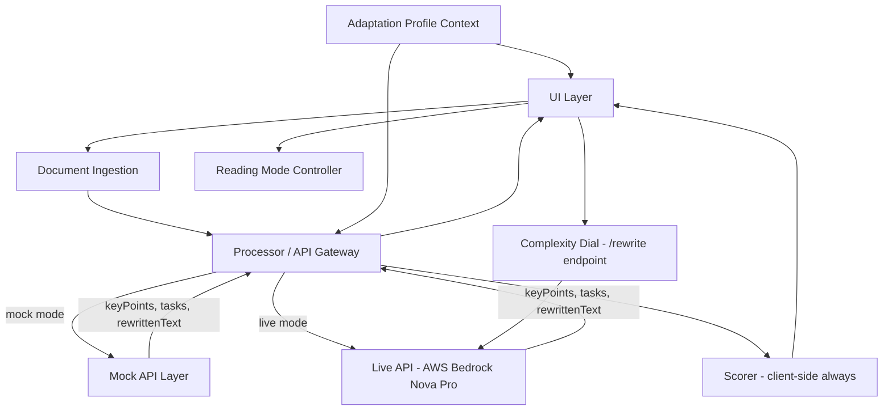

# Design Document: Academic Simplifier (CogniSync)

## Overview

CogniSync is a web application that transforms dense academic content into simplified, structured formats. It targets students with hidden cognitive challenges (ADHD, dyslexia, anxiety, processing differences) by reducing cognitive overload.

The architecture has two tiers:
- **Frontend** (React + TypeScript + Vite) — UI, ingestion, scoring, reading modes, adaptation profiles
- **Backend** (Node.js + Express) — AI processing via AWS Bedrock (Amazon Nova Pro), with a mock layer for development

Core capabilities:
- Document ingestion (file upload + text paste)
- Key point extraction
- Actionable task list with Eisenhower Priority Matrix (urgency × importance)
- Plain language rewriting with real-time Complexity Dial (Grade 1–16)
- Cognitive load scoring (before/after Flesch-Kincaid)
- Adaptive reading modes (Focus View, Step-by-Step View)
- Personalized adaptation profiles (Default, ADHD, Dyslexia, Anxiety) — affects AI tone + CSS layout
- Visual design system: card layout, gradient header, skeleton loaders, accessible focus states

---

## Architecture

The application follows a layered architecture with clear separation between UI, processing logic, and the mock/live API boundary.



### Key Architectural Decisions

1. **Two-tier architecture**: Frontend handles ingestion, scoring, and UI state. Backend (Express on port 3001) handles all AI calls via AWS Bedrock.
2. **Processor as API gateway**: All AI calls go through a single `Processor` module. The `useMock` config flag determines whether calls hit the mock layer or the live backend. Consuming components never know which mode is active.
3. **Both mock and live layers return the same shape**: `{ keyPoints, tasks, rewrittenText }`. Tasks now include `urgency` and `importance` fields for the Priority Matrix.
4. **Flesch-Kincaid scoring is always client-side**: The Scorer runs on both the original and rewritten text after the Processor returns.
5. **Reading modes are pure UI state**: Switching modes does not re-trigger processing.
6. **Adaptation profiles have two effects**: (a) they modify the Bedrock system prompt on the server, and (b) they apply CSS-level layout changes (line height, font size, letter spacing) in the frontend.
7. **Complexity Dial calls a separate `/rewrite` endpoint**: It does not re-run the full `/process` pipeline — only the rewrite step, with a target grade level and the current profile.
8. **Re-process with profile**: The raw input text is stored in context so the user can switch profiles and re-run the full pipeline without re-uploading.

---

## Components and Interfaces

### DocumentIngestion

Responsible for accepting user input (file upload or text paste) and extracting raw text.

```typescript
interface IngestionResult {
  text: string;
  sourceType: 'file' | 'paste';
  fileName?: string;
}

interface IngestionError {
  code: 'UNSUPPORTED_TYPE' | 'FILE_TOO_LARGE' | 'EXTRACTION_FAILED';
  message: string;
}

// Supported MIME types / extensions
const SUPPORTED_TYPES = [
  'application/pdf',
  'application/vnd.openxmlformats-officedocument.presentationml.presentation', // .pptx
  'application/vnd.openxmlformats-officedocument.wordprocessingml.document',   // .docx
  'application/vnd.openxmlformats-officedocument.spreadsheetml.sheet',         // .xlsx
  'text/plain',
];

const MAX_FILE_SIZE_BYTES = 100 * 1024 * 1024; // 100 MB
const MAX_PASTE_CHARS = 80_000;
```

### Processor

The central API gateway. Routes requests to mock or live implementations based on config.

```typescript
interface ProcessorConfig {
  useMock: boolean;
  mockDelayMs?: { min: number; max: number }; // default: { min: 500, max: 1500 }
}

interface ProcessorResult {
  keyPoints: KeyPoint[];
  tasks: Task[];
  rewrittenText: string;
  originalScore: ComplexityScore;
  simplifiedScore: ComplexityScore;
}

// Single entry point — processes a document end-to-end
async function processDocument(text: string, config: ProcessorConfig): Promise<ProcessorResult>
```

### Extractor

Identifies key points and actionable tasks from document text. Tasks now include urgency/importance for the Priority Matrix.

```typescript
interface KeyPoint {
  id: string;
  text: string;
}

type TaskUrgency = 'urgent' | 'not-urgent';
type TaskImportance = 'important' | 'not-important';

interface Task {
  id: string;
  description: string;     // imperative form, e.g. "Submit essay draft"
  deadline?: string;       // ISO date string or human-readable, if detected
  completed: boolean;
  urgency?: TaskUrgency;
  importance?: TaskImportance;
}

// Eisenhower quadrant derived from urgency + importance
type PriorityQuadrant = 'do-now' | 'schedule' | 'delegate' | 'eliminate';

function getQuadrant(task: Task): PriorityQuadrant
// urgent+important → do-now, not-urgent+important → schedule
// urgent+not-important → delegate, not-urgent+not-important → eliminate
```

### Rewriter

Produces a plain language version of the document targeting Flesch-Kincaid Grade Level ≤ 8.

```typescript
interface RewriterOutput {
  rewrittenText: string;
}
```

### Scorer

Computes Flesch-Kincaid readability scores client-side.

```typescript
interface ComplexityScore {
  fleschKincaidGrade: number;   // grade level
  fleschReadingEase: number;    // 0–100, higher = easier
  label: 'Very Easy' | 'Easy' | 'Fairly Easy' | 'Standard' | 'Fairly Difficult' | 'Difficult' | 'Very Confusing';
}

function scoreText(text: string): ComplexityScore
```

### ReadingModeController

Manages which reading mode is active and tracks navigation state for Focus View.

```typescript
type ReadingMode = 'focus' | 'step-by-step';

interface FocusViewState {
  currentIndex: number;
  total: number;
}

interface ReadingModeState {
  mode: ReadingMode;
  focusState?: FocusViewState;
}
```

### MockAPILayer

Returns predefined realistic responses with simulated latency.

```typescript
interface MockResponse {
  keyPoints: KeyPoint[];
  tasks: Task[];
  rewrittenText: string;
}

async function getMockResponse(inputText: string): Promise<MockResponse>
// Internally: waits random(500, 1500)ms, then returns a static or lightly-varied mock payload
```

---

## Data Models

### Document (in-memory, session-scoped)

```typescript
interface Document {
  id: string;                  // uuid, generated on ingestion
  rawText: string;             // extracted or pasted text
  sourceType: 'file' | 'paste';
  fileName?: string;
  ingestedAt: Date;
}
```

### ProcessingState

Tracks the async lifecycle of a document being processed.

```typescript
type ProcessingStatus = 'idle' | 'loading' | 'success' | 'error';

interface ProcessingState {
  status: ProcessingStatus;
  document?: Document;
  result?: ProcessorResult;
  error?: IngestionError | string;
}
```

### AppState (top-level UI state)

```typescript
type AdaptationProfile = 'default' | 'adhd' | 'dyslexia' | 'anxiety';
type ComplexityLevel = 1 | 2 | ... | 16; // Flesch-Kincaid grade target

interface AppState {
  processing: ProcessingState;
  readingMode: ReadingModeState;
  taskCompletions: Record<string, boolean>;
  adaptationProfile: AdaptationProfile;
  complexityLevel: ComplexityLevel;        // current dial position
  rewrittenAtLevel?: string;               // cached rewrite for current level
  isRewriting: boolean;                    // dial rewrite in flight
}
```

No persistent storage — all state is session-scoped in React context.

---

## Visual Design System

### Design Tokens

```css
--color-primary: #6366f1;       /* indigo */
--color-primary-light: #eef2ff;
--color-surface: #ffffff;
--color-surface-muted: #f8fafc;
--color-border: #e2e8f0;
--color-text: #0f172a;
--color-text-muted: #64748b;
--radius-sm: 8px;
--radius-md: 12px;
--radius-lg: 16px;
--shadow-sm: 0 1px 3px rgba(0,0,0,0.08);
--shadow-md: 0 4px 12px rgba(0,0,0,0.1);
--font-family: Inter, system-ui, sans-serif;
```

### Layout

- Max content width: 860px, centered
- Hero header: full-width gradient (`#6366f1` → `#8b5cf6`), contains wordmark + tagline
- Output sections: card components with colored left-border accent (4px), `border-radius: 16px`, `box-shadow: var(--shadow-sm)`
- Cards animate in with staggered `translateY(8px) → 0` + `opacity: 0 → 1`, 80ms stagger, disabled under `prefers-reduced-motion`
- Responsive: single column ≤ 640px, two-column Priority Matrix on desktop

### Profile-Driven CSS

| Profile | Font size | Line height | Letter spacing | Word spacing |
|---------|-----------|-------------|----------------|--------------|
| Default | 15px | 1.6 | normal | normal |
| ADHD | 15px | 2.0 | normal | normal |
| Dyslexia | 17px | 2.0 | 0.04em | 0.1em |
| Anxiety | 15px | 2.0 | normal | normal |

### Accessibility Requirements

- Skip-to-main link as first focusable element
- All interactive elements: `:focus-visible` ring (`outline: 2px solid #6366f1; outline-offset: 2px`)
- No `outline: none` without replacement
- No `transition: all` — list properties explicitly
- `aria-live="polite"` on: processing status, rewriting status, character count
- All icon-only buttons: `aria-label`
- Decorative icons: `aria-hidden="true"`
- `prefers-reduced-motion` guard on all animations
- `touch-action: manipulation` on interactive elements
- Checkbox + label: single hit target via `<label>` wrapping

---

---

## Correctness Properties

*A property is a characteristic or behavior that should hold true across all valid executions of a system — essentially, a formal statement about what the system should do. Properties serve as the bridge between human-readable specifications and machine-verifiable correctness guarantees.*

### Property 1: File size boundary enforcement

*For any* file submitted to the ingestion component, if its size exceeds 100 MB the ingestion function shall return a `FILE_TOO_LARGE` error, and if its size is at or below 100 MB it shall be accepted (assuming a supported type).

**Validates: Requirements 1.1, 1.6**

---

### Property 2: Paste length boundary enforcement

*For any* string submitted via the paste interface, if its character count exceeds 80,000 the ingestion function shall reject it, and if it is at or below 80,000 characters it shall be accepted.

**Validates: Requirements 1.2**

---

### Property 3: File text extraction round-trip

*For any* supported file format containing known text content, uploading that file and extracting its text shall produce output that contains the original text content.

**Validates: Requirements 1.3**

---

### Property 4: Loading state is active during processing

*For any* document submission, the `processingState.status` shall equal `'loading'` at all times while the async processing operation is in flight, and shall transition to `'success'` or `'error'` only after the operation completes.

**Validates: Requirements 1.4**

---

### Property 5: Unsupported file types are rejected

*For any* file whose MIME type or extension is not in the supported types list, the ingestion function shall return an `UNSUPPORTED_TYPE` error.

**Validates: Requirements 1.5**

---

### Property 6: Key point count invariant

*For any* document text processed by the Extractor, the number of returned Key Points shall be between 3 and 15 inclusive.

**Validates: Requirements 2.2**

---

### Property 7: Mock mode covers all operations

*For any* document text processed in mock mode, the Processor shall return a result containing all three fields — `keyPoints` (non-empty array), `tasks` (array), and `rewrittenText` (non-empty string) — without making any real HTTP requests.

**Validates: Requirements 2.4, 3.5, 6.4, 7.1, 7.4**

---

### Property 8: Task structure invariant

*For any* document text processed by the Extractor, every returned Task shall have a non-empty `description` string and a `completed` boolean field initialized to `false`.

**Validates: Requirements 3.1, 3.2**

---

### Property 9: Task completion toggle

*For any* task in the task list, toggling its completion state shall update `taskCompletions[task.id]` to the opposite boolean value, and toggling it again shall restore the original value (round-trip).

**Validates: Requirements 3.4**

---

### Property 10: Reading mode switch does not trigger reprocessing

*For any* app state where processing has completed successfully, switching between `'focus'` and `'step-by-step'` reading modes shall not change `processingState.result` or `processingState.status`.

**Validates: Requirements 4.4**

---

### Property 11: Focus View navigation stays in bounds

*For any* list of Key Points of length N, navigating forward from index i shall produce index min(i+1, N-1), navigating backward from index i shall produce index max(i-1, 0), and the `total` field shall always equal N.

**Validates: Requirements 4.2, 4.5**

---

### Property 12: Step-by-Step View item count

*For any* list of Key Points of length N, the Step-by-Step View renderer shall produce a list with exactly N items.

**Validates: Requirements 4.3**

---

### Property 13: Scorer returns valid ComplexityScore for any non-empty text

*For any* non-empty string, `scoreText` shall return a `ComplexityScore` with a numeric `fleschKincaidGrade`, a `fleschReadingEase` value in [0, 100], and a non-empty `label`.

**Validates: Requirements 5.1, 5.2, 5.5**

---

### Property 14: Complexity score percentage reduction formula

*For any* pair of original and simplified complexity scores where the original grade is greater than zero, the displayed percentage reduction shall equal `((originalGrade - simplifiedGrade) / originalGrade) * 100`, rounded to one decimal place.

**Validates: Requirements 5.4**

---

### Property 15: Rewriter returns non-empty output in mock mode

*For any* document text processed in mock mode, the `rewrittenText` field of the result shall be a non-empty string.

**Validates: Requirements 6.1**

---

### Property 16: Mock delay is within specified range

*For any* mock API call, the elapsed time from invocation to response shall be between 500ms and 1500ms inclusive.

**Validates: Requirements 7.2**

---

### Property 17: Priority Matrix quadrant assignment

*For any* task with `urgency` and `importance` fields, `getQuadrant(task)` shall return exactly one of `'do-now' | 'schedule' | 'delegate' | 'eliminate'` according to the Eisenhower mapping, and every task shall appear in exactly one quadrant.

**Validates: Visual Requirements V5**

---

### Property 18: Complexity dial level bounds

*For any* drag interaction on the complexity slider, the resulting `complexityLevel` value shall be an integer in [1, 16] inclusive.

**Validates: Visual Requirements V6**

---

### Property 19: Re-process preserves raw text

*For any* document that has been successfully processed, calling `reprocessWithProfile` with any valid profile shall invoke `processDocument` with the same raw text that was originally submitted.

**Validates: Requirement V4.5 (re-process button)**

---

### Property 20: Adaptation profile CSS invariant

*For any* active adaptation profile, the rendered app container shall apply the CSS properties defined in the profile's config (line-height, font-size, letter-spacing, word-spacing) and no other profile's properties.

**Validates: Visual Requirements V4**

---

## Error Handling

| Scenario | Error Code | User-Facing Message | Recovery |
|---|---|---|---|
| Unsupported file type | `UNSUPPORTED_TYPE` | "This file type is not supported. Please upload a PDF, DOCX, PPTX, XLSX, or TXT file." | User re-uploads |
| File exceeds 100 MB | `FILE_TOO_LARGE` | "File size exceeds the 100 MB limit. Please upload a smaller file." | User re-uploads |
| Text extraction fails | `EXTRACTION_FAILED` | "We couldn't extract text from this file. Please paste the text directly." | Paste fallback shown |
| Paste exceeds 80,000 chars | `PASTE_TOO_LONG` | "Text exceeds the 80,000 character limit. Please shorten your input." | User trims input |
| Extractor returns no key points | — | "No key points could be identified in this document." | Informational message |
| No tasks identified | — | "No actionable tasks were found in this document." | Informational message |
| Scorer fails (e.g., empty text) | — | "Complexity scoring is unavailable for this content." | Score section hidden |
| Rewriter returns empty/failed | — | "Simplification failed. Showing original content." | Original text displayed |
| Bedrock API error (live mode) | — | Server error message surfaced from `/process` response | Error card shown |
| Complexity dial rewrite fails | — | Silent fallback — original rewritten text remains displayed | No user action needed |

All errors are surfaced in the UI as inline messages within the relevant output section. No global error modals are used. The app remains functional for sections that did not error.

---

## Testing Strategy

### Dual Testing Approach

Both unit tests and property-based tests are required. They are complementary:
- Unit tests catch concrete bugs with specific known inputs and edge cases.
- Property tests verify universal correctness across a wide range of generated inputs.

### Unit Tests

Focus on:
- Specific examples demonstrating correct behavior (e.g., a known PDF with known text produces expected extraction)
- Integration between Processor and MockAPILayer
- Error condition handling (each error code in the table above)
- Default config has `useMock: true`
- Mock response structure contains all required fields

### Property-Based Tests

**Library**: [fast-check](https://github.com/dubzzz/fast-check) (TypeScript/JavaScript)

Each property test must run a minimum of **100 iterations**.

Each test must include a comment tag in the format:
`// Feature: academic-simplifier, Property {N}: {property_text}`

| Property | Test Description | Arbitraries |
|---|---|---|
| P1 | File size boundary | `fc.integer({ min: 0 })` for byte sizes |
| P2 | Paste length boundary | `fc.string()` of varying lengths |
| P3 | File text extraction round-trip | `fc.string()` wrapped in supported formats |
| P4 | Loading state during processing | Mock async state machine |
| P5 | Unsupported types rejected | `fc.string()` for MIME types not in allowed list |
| P6 | Key point count in [3, 15] | `fc.string({ minLength: 100 })` for document text |
| P7 | Mock mode covers all operations | `fc.string()` for document text |
| P8 | Task structure invariant | `fc.string()` for document text |
| P9 | Task completion toggle round-trip | `fc.uuid()` for task IDs |
| P10 | Mode switch doesn't reprocess | `fc.constantFrom('focus', 'step-by-step')` |
| P11 | Focus View navigation bounds | `fc.array(fc.string(), { minLength: 1 })` for key points |
| P12 | Step-by-Step item count | `fc.array(fc.string(), { minLength: 1 })` for key points |
| P13 | Scorer returns valid score | `fc.string({ minLength: 1 })` for text |
| P14 | Percentage reduction formula | `fc.float({ min: 0.1 })` for grade scores |
| P15 | Rewriter non-empty in mock mode | `fc.string()` for document text |
| P16 | Mock delay in [500, 1500]ms | Timing measurement over multiple calls |

### Test File Organization

```
src/
  __tests__/
    ingestion.test.ts       # P1, P2, P3, P5 + unit tests for error codes
    processor.test.ts       # P4, P7, P15, P16 + unit tests for mock/live switching
    extractor.test.ts       # P6, P8 + unit tests for edge cases
    scorer.test.ts          # P13, P14 + unit tests for known FK values
    readingModes.test.ts    # P9, P10, P11, P12 + unit tests for mode switching
```
