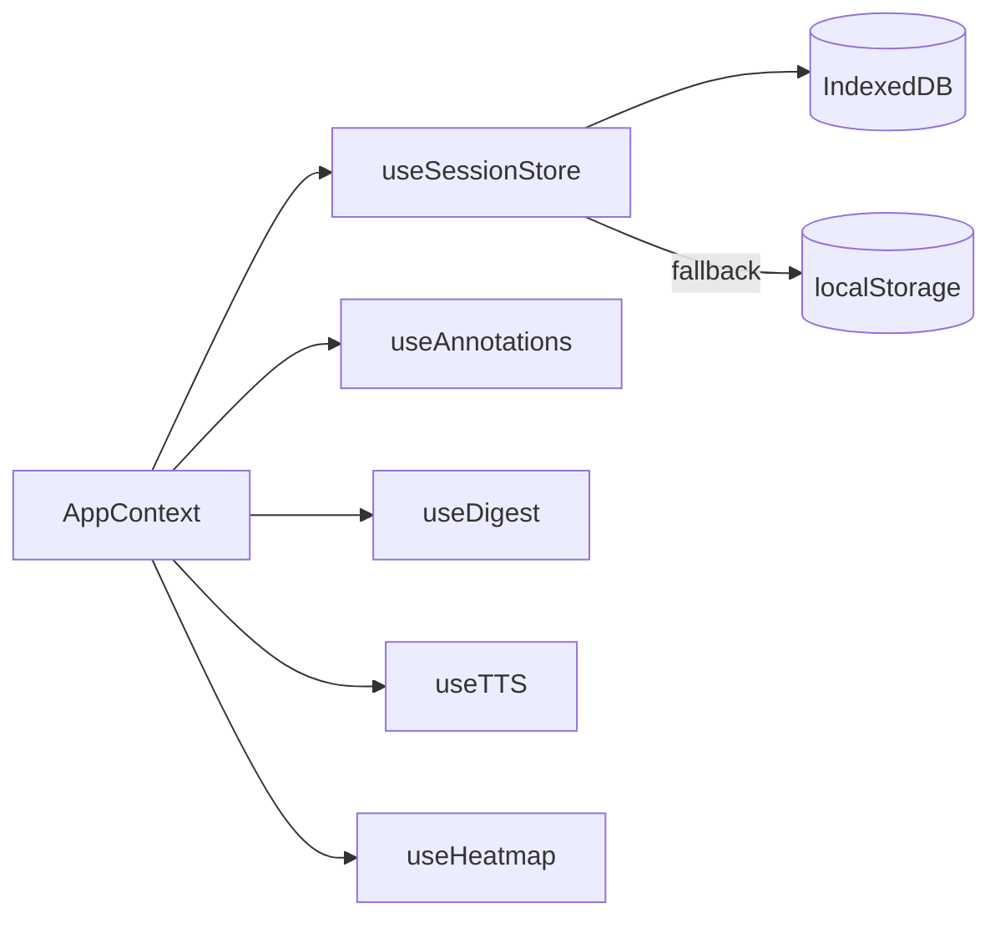

# Design Document: CogniSync Feature Expansion

## Overview

CogniSync is a React + TypeScript + Vite web application that simplifies academic documents for students with ADHD, dyslexia, and anxiety. The existing system ingests files (PDF, DOCX, PPTX, XLSX, TXT), sends text to an AWS Bedrock-backed Express server (`/process`), and renders simplified output with key points, tasks, complexity scores, and reading modes.

This expansion adds 12 new capabilities across five areas:

- **Persistence & History**: Saved Sessions via IndexedDB (Req 1)
- **Utility Features**: Calendar Export (Req 2), Task Due Date Editing (Req 3), Complexity Heatmap (Req 4), Shareable Output (Req 5), Multi-Document Synthesis (Req 6)
- **User Control**: Highlight & Ask (Req 7), Glossary Mode (Req 8), Audio Read-Aloud (Req 9), Annotation Layer (Req 10)
- **Engagement**: Weekly Digest (Req 11)
- **Platform Extension**: LMS Browser Extension (Req 12)

All new features integrate into the existing `AppContext` / `AppProvider` state model, extend the existing `types/index.ts` type system, and add new server endpoints to `server/index.js`.

---

## Architecture

### High-Level Architecture

```mermaid
graph TD
    subgraph Browser
        A[React App - cogni-sync/] --> B[AppContext / AppProvider]
        B --> C[Session_Store - IndexedDB]
        B --> D[Annotation_Store - within Session_Store]
        B --> E[Digest_Service - client-side]
        B --> F[TTS_Engine - Web Speech API]
        B --> G[Heatmap_Renderer - client-side]
        B --> H[Share_Service - client-side]
        B --> I[Calendar_Exporter - client-side]
    end

    subgraph Extension
        J[Chrome MV3 / Firefox WebExtension]
        J -->|opens new tab with text| A
    end

    subgraph Server [Node.js/Express - server/]
        K[/process]
        L[/rewrite]
        M[/score]
        N[/synthesize - NEW]
        O[/ask - NEW]
        P[/glossary - NEW]
    end

    B -->|HTTP POST| K
    B -->|HTTP POST| L
    B -->|HTTP POST| M
    B -->|HTTP POST| N
    B -->|HTTP POST| O
    B -->|HTTP POST| P
```

### State Architecture

The existing `AppContext` is extended to hold the new session management, annotation, and digest state. A new `useSessionStore` hook encapsulates all IndexedDB operations. New feature-specific hooks (`useAnnotations`, `useDigest`, `useTTS`, `useHeatmap`) keep concerns separated.



---

## Components and Interfaces

### New Client-Side Modules

| Module | Location | Responsibility |
|---|---|---|
| `useSessionStore` | `src/hooks/useSessionStore.ts` | IndexedDB CRUD for Sessions |
| `useAnnotations` | `src/hooks/useAnnotations.ts` | Annotation CRUD within a Session |
| `useDigest` | `src/hooks/useDigest.ts` | Weekly task aggregation |
| `useTTS` | `src/hooks/useTTS.ts` | Web Speech API wrapper |
| `useHeatmap` | `src/hooks/useHeatmap.ts` | Per-sentence Flesch scoring |
| `calendarExporter` | `src/calendar/calendarExporter.ts` | ICS generation + Google Calendar URL |
| `shareService` | `src/share/shareService.ts` | PDF export + base64 URL encoding |
| `SessionHistory` | `src/components/SessionHistory.tsx` | History list UI |
| `HeatmapView` | `src/components/HeatmapView.tsx` | Sentence-colored heatmap |
| `GlossaryPanel` | `src/components/GlossaryPanel.tsx` | Jargon underlines + definitions panel |
| `AnnotationLayer` | `src/components/AnnotationLayer.tsx` | Highlight + note overlay |
| `WeeklyDigest` | `src/components/WeeklyDigest.tsx` | Digest view |
| `ReadAloudControls` | `src/components/ReadAloudControls.tsx` | TTS play/pause/stop |

### New Server Endpoints

| Endpoint | Method | Purpose |
|---|---|---|
| `/synthesize` | POST | Merge multiple ProcessorResults into a "week at a glance" summary |
| `/ask` | POST | Answer a follow-up question about a selected passage |
| `/glossary` | POST | Detect jargon terms and return definitions |

### Extension Files

| File | Purpose |
|---|---|
| `extension/manifest.json` | Chrome MV3 manifest |
| `extension/manifest.firefox.json` | Firefox WebExtension manifest |
| `extension/content.js` | Content script — injects button, extracts text |
| `extension/background.js` | Service worker (Chrome) / background script (Firefox) |

---

## Data Models

### Extended Types (`src/types/index.ts` additions)

```typescript
// --- Session ---

export interface Annotation {
  id: string;
  sessionId: string;
  startOffset: number;   // character offset in simplified text
  endOffset: number;
  color?: string;        // highlight color hex, undefined = note-only
  note?: string;         // user note text, undefined = highlight-only
  createdAt: string;     // ISO timestamp
}

export interface Session {
  id: string;
  savedAt: string;                        // ISO timestamp
  fileName?: string;                      // source file name(s)
  rawText: string;
  result: ProcessorResult;
  adaptationProfile: AdaptationProfile;
  complexityLevel: ComplexityLevel;
  taskCompletions: Record<string, boolean>;
  annotations: Annotation[];
}

// --- Heatmap ---

export interface SentenceScore {
  text: string;
  score: number;   // Flesch Reading Ease 0–100
  label: ComplexityScore['label'];
}

// --- Glossary ---

export interface JargonTerm {
  term: string;
  definition: string;
  exampleSentence: string;
}

export interface GlossaryResult {
  terms: JargonTerm[];   // up to 20
}

// --- Synthesis ---

export interface SynthesisResult {
  sessions: ProcessorResult[];
  mergedTasks: Task[];          // sorted by deadline, labeled with source
  mergedKeyPoints: KeyPoint[];  // deduplicated
  summary: string;              // "week at a glance" paragraph from /synthesize
}

// --- Ask ---

export interface AskResult {
  question: string;
  answer: string;
  selectionText: string;
}

// --- Digest ---

export interface DigestTask extends Task {
  sourceFileName?: string;
  sessionId: string;
}

export interface WeeklyDigestResult {
  tasks: DigestTask[];   // tasks due within next 7 days, sorted by deadline
}
```

### IndexedDB Schema

Database name: `cognisync_db`, version `1`.

| Object Store | Key Path | Indexes |
|---|---|---|
| `sessions` | `id` | `savedAt` (for ordering), `fileName` |

Sessions are stored as plain JSON-serializable objects. The 50-session cap is enforced on write by querying the `savedAt` index and deleting the oldest entry when count exceeds 50.

### ICS Event Structure

Each VEVENT generated by `calendarExporter` follows RFC 5545:

```
BEGIN:VCALENDAR
VERSION:2.0
PRODID:-//CogniSync//EN
BEGIN:VEVENT
UID:<uuid>@cognisync
DTSTAMP:<now in UTC>
DTSTART;VALUE=DATE:<YYYYMMDD>
SUMMARY:<task description>
DESCRIPTION:Exported from CogniSync
END:VEVENT
...
END:VCALENDAR
```

### Shareable URL Format

```
https://<app-base>/?share=<base64url(JSON.stringify({ keyPoints, tasks, rewrittenText, tldr }))>
```

The payload is compressed with `LZString` before base64 encoding to stay within the 8,000-character limit for typical documents.

---

## Correctness Properties

*A property is a characteristic or behavior that should hold true across all valid executions of a system — essentially, a formal statement about what the system should do. Properties serve as the bridge between human-readable specifications and machine-verifiable correctness guarantees.*


### Property 1: Session Save/Restore Round-Trip

*For any* Session object (containing rawText, ProcessorResult, adaptationProfile, complexityLevel, taskCompletions, and annotations), saving it to the Session_Store and then restoring it by ID should produce an object that is deeply equal to the original.

**Validates: Requirements 1.2, 1.5**

### Property 2: Session History Ordering

*For any* collection of saved Sessions with distinct `savedAt` timestamps, the list returned by the Session_Store should be sorted in descending order by `savedAt` (most recent first).

**Validates: Requirements 1.4**

### Property 3: Session Delete Removes Entry

*For any* Session ID present in the Session_Store, deleting that Session should result in the Session_Store no longer containing an entry with that ID, and the history list should not include it.

**Validates: Requirements 1.6**

### Property 4: Session Count Cap

*For any* sequence of save operations that would result in more than 50 Sessions, the Session_Store should contain at most 50 Sessions after each operation, and the removed Session should be the one with the oldest `savedAt` timestamp.

**Validates: Requirements 1.7**

### Property 5: ICS VEVENT Count Matches Tasks with Deadlines

*For any* list of Tasks, the ICS string generated by `calendarExporter` should contain exactly as many VEVENT blocks as there are Tasks with non-empty, parseable deadline fields.

**Validates: Requirements 2.2**

### Property 6: ICS RFC 5545 Structure

*For any* non-empty list of Tasks with deadlines, the generated ICS string should contain the required RFC 5545 fields: `BEGIN:VCALENDAR`, `VERSION:2.0`, `PRODID`, at least one `BEGIN:VEVENT`/`END:VEVENT` pair, `UID`, `DTSTAMP`, `DTSTART`, `SUMMARY`, and `END:VCALENDAR`.

**Validates: Requirements 2.6**

### Property 7: Google Calendar URL Contains Task Data

*For any* Task with a valid deadline, the Google Calendar URL generated by `calendarExporter` should contain the task description and the deadline date encoded in the URL query parameters.

**Validates: Requirements 2.4**

### Property 8: Deadline Mutation Correctness

*For any* Task and any valid date string, updating the task's deadline to that string should result in the task having exactly that deadline value; clearing the deadline field should result in the task's deadline being `undefined`.

**Validates: Requirements 3.3, 3.4**

### Property 9: Deadline Validation Rejects Invalid Formats

*For any* string that is not a recognizable date format (e.g., random alphanumeric strings, empty strings), the deadline validator should return an error; for any valid date string, it should return success.

**Validates: Requirements 3.2**

### Property 10: Heatmap Sentence Count Matches Input

*For any* non-empty text string, the number of `SentenceScore` objects returned by `Heatmap_Renderer` should equal the number of sentences detected in that text (split on `.`, `!`, `?`).

**Validates: Requirements 4.2**

### Property 11: Heatmap Color Monotonicity

*For any* two Sentence_Score values A and B where A > B, the color assigned to A should be "greener" (higher green channel, lower red channel) than the color assigned to B, and for the anxiety profile, the color should shift from blue (high score) to orange (low score) instead.

**Validates: Requirements 4.3, 4.6**

### Property 12: Share Encode/Decode Round-Trip

*For any* shareable payload (containing `keyPoints`, `tasks`, `rewrittenText`, `tldr`), encoding it with `shareService.encode` and then decoding the result with `shareService.decode` should produce an object deeply equal to the original.

**Validates: Requirements 5.3, 5.4**

### Property 13: Shareable URL Length Invariant

*For any* ProcessorResult, the shareable URL produced by `shareService` should never exceed 8,000 characters.

**Validates: Requirements 5.5**

### Property 14: Batch File Count Boundary

*For any* file list of length N, the batch processor should accept all N files when N ≤ 10, and should process exactly 10 files when N > 10.

**Validates: Requirements 6.1**

### Property 15: Synthesis Merge Correctness

*For any* list of ProcessorResults, the merged task list produced by the Synthesizer should be sorted by deadline ascending (tasks without deadlines last), and the merged key points list should contain no duplicate text entries.

**Validates: Requirements 6.3**

### Property 16: Synthesis Source Labels

*For any* merged Session produced from N source files, every task and key point in the merged result should have a non-empty `sourceFileName` label corresponding to one of the N input file names.

**Validates: Requirements 6.5**

### Property 17: Ask Answer Count Cap

*For any* sequence of "Ask about this" interactions within a single Session view, the number of simultaneously visible inline answers should never exceed 5.

**Validates: Requirements 7.7**

### Property 18: Glossary Term Count Cap

*For any* simplified text, the `GlossaryResult` returned by the `/glossary` endpoint should contain at most 20 `JargonTerm` entries.

**Validates: Requirements 8.1**

### Property 19: Glossary Card Content Completeness

*For any* `JargonTerm` in a `GlossaryResult`, the glossary card rendered for that term should contain all three fields: `term`, `definition`, and `exampleSentence`, and none should be empty.

**Validates: Requirements 8.3**

### Property 20: TTS Profile Configuration

*For any* adaptation profile, the TTS configuration object produced by `useTTS` should set `rate = 0.85` when the profile is `"dyslexia"` and `pitch = 0.9` when the profile is `"anxiety"`, and use default values (rate = 1.0, pitch = 1.0) for all other profiles.

**Validates: Requirements 9.7, 9.8**

### Property 21: TTS Key Points Read in Order

*For any* list of key points, the TTS utterances queued by `useTTS` when reading key points should be in the same order as the input key points array.

**Validates: Requirements 9.3**

### Property 22: TTS Stop Returns to Idle

*For any* TTS playback state (playing or paused), activating Stop should result in the TTS state being `"idle"` and no speech synthesis being active.

**Validates: Requirements 9.6**

### Property 23: Annotation Persistence Round-Trip

*For any* Session containing a non-empty list of Annotations, saving the Session to the Session_Store and then restoring it should produce a Session whose annotations list is deeply equal to the original annotations list.

**Validates: Requirements 10.6, 10.7**

### Property 24: Annotation Delete Removes Entry

*For any* Annotation present in a Session's annotation list, deleting that Annotation should result in the annotation list no longer containing an entry with that Annotation's ID.

**Validates: Requirements 10.8**

### Property 25: Highlight Color Palette Size

*For any* annotation highlight operation, the color assigned should be one of at least 3 distinct colors from the defined palette.

**Validates: Requirements 10.3**

### Property 26: Digest Filters to 7-Day Window and Sorts Ascending

*For any* collection of Sessions with tasks at various deadlines, the `Digest_Service` should return only tasks whose deadlines fall within the next 7 calendar days from the current date, and those tasks should be sorted by deadline in ascending order.

**Validates: Requirements 11.2, 11.3**

### Property 27: Extension Text Extraction Non-Empty on Valid LMS Page

*For any* DOM representing a valid LMS page with a detectable main content region, the Extension's `extractContent` function should return a non-empty string.

**Validates: Requirements 12.3**

### Property 28: Extension Settings Preserved Across Update

*For any* user configuration object stored by the Extension, simulating an extension update (re-initialization without clearing storage) should result in the same configuration object being retrievable.

**Validates: Requirements 12.7**

---

## Error Handling

### Client-Side Error Boundaries

- All new async hooks (`useSessionStore`, `useAnnotations`, `useDigest`) wrap IndexedDB operations in try/catch and surface errors via the existing `showToast` mechanism.
- `useTTS` checks `'speechSynthesis' in window` before any TTS operation and sets a `supported: false` flag that hides the Read Aloud controls.
- `shareService.decode` wraps `atob` + `JSON.parse` in try/catch; a malformed `?share=` parameter renders an error state instead of crashing.
- `calendarExporter` skips tasks with unparseable deadlines, collects skipped task descriptions, and returns them alongside the ICS blob so the UI can notify the user.

### Server-Side Error Handling (new endpoints)

All three new endpoints (`/synthesize`, `/ask`, `/glossary`) follow the existing pattern:
- Return `400` for missing/invalid request body fields.
- Return `500` with `{ error: message }` for Bedrock invocation failures.
- The client displays inline error messages (not full-page errors) for all three, allowing retry without losing session state.

### Batch Processing Errors (Req 6)

Each file in a batch is processed independently. A per-file error state is tracked in an array. Failed files show an inline error badge in the progress indicator. Processing continues for remaining files regardless of individual failures.

### Extension Error Handling (Req 12)

If the content script cannot identify a main content region (no `main`, `#content`, `.content`, `article` selector matches), it falls back to displaying the tooltip message and opens the app without pre-loaded text. No error is thrown to the browser console.

---

## Testing Strategy

### Dual Testing Approach

Both unit tests and property-based tests are required. They are complementary:
- **Unit tests** cover specific examples, integration points, and edge cases.
- **Property-based tests** verify universal correctness across randomized inputs.

### Property-Based Testing Library

**Target**: `fast-check` (TypeScript-native, works with Vitest, the existing test runner).

Install: `npm install --save-dev fast-check`

Each property-based test must run a minimum of **100 iterations** (fast-check default is 100; set `numRuns: 100` explicitly for clarity).

Each test must include a comment tag in the format:
```
// Feature: cognisync-feature-expansion, Property N: <property_text>
```

### Property Test Mapping

| Property | Test File | fast-check Arbitraries |
|---|---|---|
| P1: Session round-trip | `useSessionStore.test.ts` | `fc.record({ id: fc.uuid(), rawText: fc.string(), ... })` |
| P2: History ordering | `useSessionStore.test.ts` | `fc.array(fc.record({ savedAt: fc.date() }), { minLength: 2 })` |
| P3: Session delete | `useSessionStore.test.ts` | `fc.uuid()` |
| P4: Session count cap | `useSessionStore.test.ts` | `fc.array(sessionArb, { minLength: 51, maxLength: 60 })` |
| P5: ICS VEVENT count | `calendarExporter.test.ts` | `fc.array(taskArb)` |
| P6: ICS RFC 5545 structure | `calendarExporter.test.ts` | `fc.array(taskWithDeadlineArb, { minLength: 1 })` |
| P7: Google Calendar URL | `calendarExporter.test.ts` | `taskWithDeadlineArb` |
| P8: Deadline mutation | `taskDeadline.test.ts` | `fc.string()`, `validDateArb` |
| P9: Deadline validation | `taskDeadline.test.ts` | `fc.string()` |
| P10: Heatmap sentence count | `useHeatmap.test.ts` | `fc.string({ minLength: 10 })` |
| P11: Heatmap color monotonicity | `useHeatmap.test.ts` | `fc.tuple(fc.float({ min: 0, max: 100 }), fc.float({ min: 0, max: 100 }))` |
| P12: Share encode/decode | `shareService.test.ts` | `fc.record({ keyPoints: fc.array(...), tasks: fc.array(...), rewrittenText: fc.string() })` |
| P13: URL length invariant | `shareService.test.ts` | `processorResultArb` |
| P14: Batch file count | `batchProcessor.test.ts` | `fc.array(fc.constant(mockFile), { minLength: 1, maxLength: 15 })` |
| P15: Synthesis merge | `synthesizer.test.ts` | `fc.array(processorResultArb, { minLength: 2 })` |
| P16: Synthesis source labels | `synthesizer.test.ts` | `fc.array(processorResultArb, { minLength: 1 })` |
| P17: Ask answer cap | `highlightAsk.test.ts` | `fc.array(askResultArb, { minLength: 6, maxLength: 10 })` |
| P18: Glossary term cap | `glossaryService.test.ts` | `fc.string({ minLength: 50 })` |
| P19: Glossary card content | `glossaryService.test.ts` | `fc.array(jargonTermArb, { minLength: 1 })` |
| P20: TTS profile config | `useTTS.test.ts` | `fc.constantFrom('default', 'adhd', 'dyslexia', 'anxiety')` |
| P21: TTS key points order | `useTTS.test.ts` | `fc.array(keyPointArb, { minLength: 1 })` |
| P22: TTS stop → idle | `useTTS.test.ts` | `fc.constantFrom('playing', 'paused')` |
| P23: Annotation round-trip | `useAnnotations.test.ts` | `fc.array(annotationArb, { minLength: 1 })` |
| P24: Annotation delete | `useAnnotations.test.ts` | `annotationArb` |
| P25: Highlight palette size | `useAnnotations.test.ts` | `fc.nat({ max: 2 })` |
| P26: Digest filter + sort | `useDigest.test.ts` | `fc.array(sessionWithTasksArb, { minLength: 1 })` |
| P27: Extension extraction | `content.test.js` | `fc.record({ mainContent: fc.string({ minLength: 1 }) })` |
| P28: Extension settings | `extension.test.js` | `fc.record({ theme: fc.string(), profile: fc.string() })` |

### Unit Test Coverage

Unit tests (in `cogni-sync/src/__tests__/`) should cover:
- **Examples**: UI rendering after processing (save button appears, heatmap appears, export actions appear, Read Aloud controls appear, annotation toggle appears)
- **Integration**: `/synthesize`, `/ask`, `/glossary` endpoint request/response shapes
- **Edge cases**: TTS unsupported browser (hidden controls), glossary endpoint unavailable (hidden underlines), extension content region not found (tooltip + empty tab), batch file with one failure (remaining files processed), shareable link with oversized payload (truncation notice)

### Test Configuration

```typescript
// vitest.config.ts addition
test: {
  globals: true,
  environment: 'jsdom',
  setupFiles: ['./src/__tests__/setup.ts'],
}
```

Property tests use fast-check's `fc.assert(fc.property(...), { numRuns: 100 })` pattern throughout.
