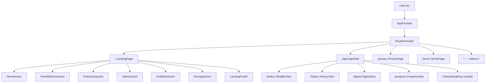

# Design Document: CogniSync Ship-Ready Transformation

## Overview

This document describes the technical design for transforming CogniSync from a single-page tool into a shippable multi-page SaaS product. The transformation introduces React Router v6 for client-side routing, a conversion-focused landing page, a persistent app shell with tab navigation, a first-time onboarding flow, design system hardening, a print stylesheet for PDF export, and polished share functionality.

The existing core processing pipeline (AI simplification, complexity dial, priority matrix, session history) is preserved intact. The transformation wraps it in a production-quality shell without rewriting business logic.

### Key Design Decisions

- **React Router v6 with `createBrowserRouter`** — chosen over the legacy `<BrowserRouter>` API for better data loading patterns and cleaner nested route definitions.
- **`AppProvider` wraps the entire router** — so context (processing state, sessions, toasts) is available on all routes including legal pages.
- **Landing page is a pure presentational component** — no dependency on `AppContext`, keeping it fast and independently testable.
- **Onboarding is localStorage-gated at the `AppShell` level** — not inside individual route components, so it fires once regardless of which `/app/*` sub-route the user lands on.
- **Print stylesheet via `@media print` in `tokens.css`** — avoids a separate file and keeps all style concerns co-located.
- **No new state management library** — existing `AppContext` + `useSessionStore` hooks are sufficient; routing state lives in the URL.

---

## Architecture

### Route Tree

```
/                          → LandingPage
/app                       → AppShell (layout route)
  /app  (index)            → SimplifyView  (DocumentIngestion + results)
  /app/simplify            → SimplifyView  (alias)
  /app/history             → HistoryView   (SessionHistory full-page)
  /app/digest              → DigestView    (WeeklyDigest full-page)
  /app/progress            → ProgressView  (ProgressTracker full-page)
/privacy                   → PrivacyPage
/terms                     → TermsPage
*                          → redirect to /
```

### Component Hierarchy (new components in bold)

```
main.tsx
└── AppProvider
    └── RouterProvider (createBrowserRouter)
        ├── / → LandingPage
        │       ├── LandingNav
        │       ├── HeroSection
        │       ├── HowItWorksSection
        │       ├── FeaturesSection
        │       ├── StatsSection
        │       ├── ProfilesSection
        │       ├── PricingSection
        │       └── LandingFooter
        ├── /app → AppShell
        │       ├── AppHeader (new, replaces Header for /app routes)
        │       ├── OnboardingFlow (modal, shown once)
        │       └── <Outlet />
        │           ├── (index) → SimplifyView
        │           ├── /history → HistoryView
        │           ├── /digest  → DigestView
        │           └── /progress → ProgressView
        ├── /privacy → PrivacyPage
        ├── /terms   → TermsPage
        └── * → <Navigate to="/" />
```

### Mermaid Diagram



---

## Components and Interfaces

### New Components

#### `LandingPage` (`src/pages/LandingPage.tsx`)
Pure presentational component. No `AppContext` dependency. Composed of section sub-components.

```typescript
// No props — self-contained marketing page
export function LandingPage(): JSX.Element
```

Section sub-components (co-located in `src/pages/landing/`):
- `HeroSection` — headline, sub-headline, two CTAs, animated gradient background
- `HowItWorksSection` — three-step explainer with icons
- `FeaturesSection` — six feature cards in responsive grid
- `StatsSection` — stat callouts + testimonial cards
- `ProfilesSection` — interactive profile switcher with live sample text
- `PricingSection` — three tier cards (Free, Pro, Institution)
- `LandingFooter` — logo, nav links, legal links, copyright

#### `AppShell` (`src/pages/AppShell.tsx`)
Layout route component. Renders persistent header, onboarding modal (if needed), and `<Outlet />`.

```typescript
export function AppShell(): JSX.Element
// Reads onboarding flag from localStorage
// Renders AppHeader + OnboardingFlow + <Outlet />
```

#### `AppHeader` (`src/components/AppHeader.tsx`)
Replaces the existing `Header` component for `/app` routes. Includes logo (links to `/`), tab nav, theme toggle, and profile selector dropdown.

```typescript
interface AppHeaderProps {
  activeTab: 'simplify' | 'history' | 'digest' | 'progress';
}
export function AppHeader({ activeTab }: AppHeaderProps): JSX.Element
```

Tab definitions:
```typescript
const TABS = [
  { id: 'simplify',  label: 'Simplify',  icon: DocumentIcon, path: '/app' },
  { id: 'history',   label: 'History',   icon: ClockIcon,    path: '/app/history' },
  { id: 'digest',    label: 'Digest',    icon: CalendarIcon, path: '/app/digest' },
  { id: 'progress',  label: 'Progress',  icon: ChartIcon,    path: '/app/progress' },
] as const;
```

#### `OnboardingFlow` (`src/components/OnboardingFlow.tsx`)
Three-step modal. Controlled by `AppShell`. Writes `cognisync_onboarded` to localStorage on completion or full skip.

```typescript
interface OnboardingFlowProps {
  onComplete: () => void;
}
export function OnboardingFlow({ onComplete }: OnboardingFlowProps): JSX.Element
```

Steps:
1. Profile selection — renders `AdaptationProfileSelector`
2. Reading mode selection — renders `ReadingModeToggle`
3. Sample document upload — renders `DocumentIngestion` with a pre-loaded sample

#### View Components (thin wrappers)

```typescript
// src/pages/SimplifyView.tsx — existing AppContent logic moved here
export function SimplifyView(): JSX.Element

// src/pages/HistoryView.tsx
export function HistoryView(): JSX.Element

// src/pages/DigestView.tsx
export function DigestView(): JSX.Element

// src/pages/ProgressView.tsx
export function ProgressView(): JSX.Element
```

#### `PrivacyPage` / `TermsPage` (`src/pages/`)
Static content pages. Render a minimal header with logo linking to `/` and placeholder legal text.

```typescript
export function PrivacyPage(): JSX.Element
export function TermsPage(): JSX.Element
```

### Modified Components

#### `Header.tsx` → split
The existing `Header` contains both the navbar and the hero section. After the transformation:
- The hero section moves into `HeroSection` inside `LandingPage`.
- The navbar styles are reused in `AppHeader` and `LandingNav`.
- `Header.tsx` can be kept as-is for backward compatibility or deprecated.

#### `FloatingActions.tsx`
Add a dedicated "Export as PDF" action that calls `window.print()` instead of the current `generatePDF` iframe approach. The existing share action is retained.

#### `ComplexityDial.tsx`
Update `COMPLEXITY_LABELS` in `types/index.ts` to the full mapping required by Requirement 13:

```typescript
export const COMPLEXITY_LABELS: Record<number, string> = {
  1:  'Kindergarten',
  2:  'Early Elementary',
  3:  'Early Elementary',
  4:  'Elementary',
  5:  'Elementary',
  6:  'Middle School',
  7:  'Middle School',
  8:  'High School',
  9:  'High School',
  10: 'Early College',
  11: 'Early College',
  12: 'College',
  13: 'College',
  14: 'Advanced',
  15: 'Advanced',
  16: 'Graduate',
};
```

The `getClosestLabel` helper in `ComplexityDial.tsx` is replaced with a direct lookup since every level now has an entry.

---

## Data Models

### Onboarding State (localStorage)

```typescript
// Key: 'cognisync_onboarded'
// Value: 'true' (string) — presence of key is sufficient
localStorage.setItem('cognisync_onboarded', 'true');
const isOnboarded = localStorage.getItem('cognisync_onboarded') === 'true';
```

### Router Initialization (`src/router.tsx`)

```typescript
import { createBrowserRouter, Navigate } from 'react-router-dom';

export const router = createBrowserRouter([
  { path: '/',         element: <LandingPage /> },
  {
    path: '/app',
    element: <AppShell />,
    children: [
      { index: true,          element: <SimplifyView /> },
      { path: 'simplify',     element: <SimplifyView /> },
      { path: 'history',      element: <HistoryView /> },
      { path: 'digest',       element: <DigestView /> },
      { path: 'progress',     element: <ProgressView /> },
    ],
  },
  { path: '/privacy',  element: <PrivacyPage /> },
  { path: '/terms',    element: <TermsPage /> },
  { path: '*',         element: <Navigate to="/" replace /> },
]);
```

### `main.tsx` update

```typescript
import { RouterProvider } from 'react-router-dom';
import { AppProvider } from './context/AppContext';
import { router } from './router';

createRoot(document.getElementById('root')!).render(
  <StrictMode>
    <AppProvider>
      <RouterProvider router={router} />
    </AppProvider>
  </StrictMode>
);
```

### Share URL format (unchanged)

The existing `encode`/`decode` functions in `shareService.ts` are used as-is. The share URL format is:
```
https://cognisync.app/?share=<lz-string-compressed-payload>
```

The `SimplifyView` reads the `?share=` param on mount (moved from `App.tsx`).

### Print Stylesheet Data Flow

```
User clicks "Export as PDF"
  → FloatingActions calls window.print()
  → Browser applies @media print rules from tokens.css
  → Hidden elements: .navbar, .fab-main, .fab-actions, .profile-section,
                     .upload-section, .app-tabs, .onboarding-modal
  → Visible elements: .tldr-banner, .card (key points, content, tasks)
  → Page breaks: avoid breaking inside .card
```

---

## Design System Updates

### `tokens.css` additions

```css
/* Button height scale */
--btn-height-sm: 40px;
--btn-height-md: 48px;
--btn-height-lg: 56px;
--btn-radius: 8px;

/* Card padding */
--card-padding: 24px;
--card-radius: 12px;

/* Print stylesheet */
@media print {
  body::before { display: none; }
  .navbar, .app-tabs, .fab-main, .fab-actions,
  .profile-section, .upload-section, .progress-tracker,
  .onboarding-modal, .toast-container,
  .read-aloud-controls, .complexity-dial,
  .floating-actions { display: none !important; }

  .card { break-inside: avoid; box-shadow: none; border: 1px solid #ccc; }
  body { background: white; color: black; }
  a { color: black; text-decoration: underline; }
}
```

### `components.css` additions

```css
/* Standardized button base */
.btn {
  display: inline-flex;
  align-items: center;
  justify-content: center;
  gap: 8px;
  height: var(--btn-height-md);
  padding: 0 20px;
  border-radius: var(--btn-radius);
  font-family: var(--font-sans);
  font-size: var(--font-size-sm);
  font-weight: var(--font-weight-semibold);
  cursor: pointer;
  border: none;
  transition: transform var(--transition-fast), box-shadow var(--transition-fast);
}
.btn:hover {
  transform: translateY(-1px);
  box-shadow: var(--shadow-md);
}
.btn-sm { height: var(--btn-height-sm); padding: 0 14px; font-size: var(--font-size-xs); }
.btn-lg { height: var(--btn-height-lg); padding: 0 28px; font-size: var(--font-size-base); }
.btn-primary {
  background: linear-gradient(135deg, var(--color-primary), var(--color-secondary));
  color: white;
}
.btn-ghost {
  background: transparent;
  border: 1px solid var(--border-default);
  color: var(--text-secondary);
}

/* App tab navigation */
.app-tabs {
  display: flex;
  gap: 4px;
  align-items: center;
}
.app-tab {
  display: flex;
  align-items: center;
  gap: 6px;
  height: 36px;
  padding: 0 14px;
  border-radius: 8px;
  font-size: 13px;
  font-weight: 600;
  color: var(--text-secondary);
  text-decoration: none;
  transition: background var(--transition-fast), color var(--transition-fast);
  white-space: nowrap;
}
.app-tab:hover { background: var(--border-subtle); color: var(--text-primary); }
.app-tab[aria-current="page"] {
  background: rgba(99, 102, 241, 0.15);
  color: var(--color-primary-light);
}
@media (max-width: 768px) {
  .app-tab span { display: none; }
  .app-tab { padding: 0 10px; }
}
```

---

## Correctness Properties

*A property is a characteristic or behavior that should hold true across all valid executions of a system — essentially, a formal statement about what the system should do. Properties serve as the bridge between human-readable specifications and machine-verifiable correctness guarantees.*

### Property 1: Undefined Route Redirect

*For any* path string that does not match `/`, `/app`, `/app/*`, `/privacy`, or `/terms`, rendering the router at that path should result in the user being redirected to `/`.

**Validates: Requirements 1.9**

### Property 2: Tab Navigation Correctness

*For any* tab in the AppShell tab set (`simplify`, `history`, `digest`, `progress`), clicking that tab should navigate to its corresponding route, and that tab — and only that tab — should have the active visual state.

**Validates: Requirements 9.3, 9.4, 9.5**

### Property 3: Profile Switcher Sample Rendering

*For any* adaptation profile in the set `{default, adhd, dyslexia, anxiety}`, selecting that profile in the `ProfilesSection` should render the sample paragraph with the typography rules defined for that profile (line-height, font-size, letter-spacing, word-spacing).

**Validates: Requirements 6.3**

### Property 4: Onboarding Completion Flag

*For any* completion path through the `OnboardingFlow` (completing all steps or skipping any step), the `cognisync_onboarded` key should be present in `localStorage` after the flow ends, and re-mounting `AppShell` should not render the `OnboardingFlow` modal.

**Validates: Requirements 10.7, 10.8**

### Property 5: ComplexityDial Label Mapping

*For any* complexity level value in the range 1–16, the label displayed by `ComplexityDial` should exactly match the entry in the `COMPLEXITY_LABELS` mapping defined in `types/index.ts`.

**Validates: Requirements 12.2, 13.1, 13.2, 13.3**

### Property 6: PDF Export Content Completeness

*For any* `ProcessorResult` with non-empty `keyPoints`, `rewrittenText`, and `tasks`, the HTML string generated for printing should contain the TLDR summary (if present), at least one key point text, the simplified text content, and at least one task description.

**Validates: Requirements 14.3**

### Property 7: Share Payload Round-Trip

*For any* `SharePayload` whose encoded URL length does not exceed `MAX_URL_LENGTH`, calling `decode(encode(payload).url)` should produce a payload with identical `keyPoints`, `tasks`, `rewrittenText`, and `tldr` fields.

**Validates: Requirements 15.2**

---

## Error Handling

### Routing Errors
- Unknown routes use a catch-all `*` route that renders `<Navigate to="/" replace />` — no error page needed for this scope.
- If `createBrowserRouter` fails (extremely unlikely), the app falls back to a blank screen; a future enhancement could add an `errorElement` at the root route.

### Onboarding localStorage Errors
- `localStorage.getItem` / `setItem` are wrapped in try/catch. If storage is unavailable (private browsing quota exceeded), the onboarding modal is shown but the flag write failure is silently ignored — the user sees onboarding again on next visit, which is acceptable.

### PDF Export Errors
- `window.print()` is synchronous and does not throw. If the browser blocks the print dialog, nothing happens — no error state needed.
- The "Export as PDF" button is disabled (`aria-disabled`) when `processing.status !== 'success'`.

### Share Errors
- `navigator.clipboard.writeText` can fail (permissions denied). The existing `FloatingActions` already has a fallback using `document.execCommand('copy')`.
- If the encoded URL exceeds `MAX_URL_LENGTH`, the existing `encode` function truncates `rewrittenText` and returns `truncated: true`. The UI shows a warning Toast (already implemented in `App.tsx`).

### React Router Navigation Errors
- `useNavigate` calls are always to known routes — no dynamic route construction that could produce invalid paths.

---

## Testing Strategy

### Unit Tests (example-based)

Focus on specific behaviors and edge cases:

- `LandingPage` renders hero headline, two CTA buttons, "How It Works" section with 3 steps, features section with 6 cards, pricing section with 3 tiers, and footer links.
- `AppShell` shows `OnboardingFlow` when `localStorage` has no `cognisync_onboarded` key.
- `AppShell` does NOT show `OnboardingFlow` when `cognisync_onboarded` is set.
- `AppHeader` renders all 4 tabs; the tab matching the current route has `aria-current="page"`.
- `OnboardingFlow` "Skip" button on step 1 advances to step 2 without saving a profile.
- `FloatingActions` "Export as PDF" button calls `window.print()`.
- `FloatingActions` "Export as PDF" button is disabled when no result exists.
- `PrivacyPage` and `TermsPage` render a last-updated date and a link to `/`.
- Undefined route `"/xyz"` redirects to `"/"`.

### Property-Based Tests (fast-check)

The project already has `fast-check` installed. Each property test runs a minimum of 100 iterations.

**Property 1 — Undefined Route Redirect**
```typescript
// Feature: cognisync-ship-ready-transformation, Property 1: undefined route redirect
fc.assert(fc.property(
  fc.string({ minLength: 1 }).filter(s => !isKnownRoute(s)),
  (path) => {
    // render router at path, assert location is /
  }
), { numRuns: 100 });
```

**Property 2 — Tab Navigation Correctness**
```typescript
// Feature: cognisync-ship-ready-transformation, Property 2: tab navigation correctness
fc.assert(fc.property(
  fc.constantFrom('simplify', 'history', 'digest', 'progress'),
  (tab) => {
    // click tab, assert URL matches tab.path, assert only that tab has aria-current="page"
  }
), { numRuns: 100 });
```

**Property 3 — Profile Switcher Sample Rendering**
```typescript
// Feature: cognisync-ship-ready-transformation, Property 3: profile switcher sample rendering
fc.assert(fc.property(
  fc.constantFrom('default', 'adhd', 'dyslexia', 'anxiety'),
  (profile) => {
    // click profile button, assert sample paragraph has expected inline styles
  }
), { numRuns: 100 });
```

**Property 4 — Onboarding Completion Flag**
```typescript
// Feature: cognisync-ship-ready-transformation, Property 4: onboarding completion flag
fc.assert(fc.property(
  fc.array(fc.constantFrom('next', 'skip'), { minLength: 3, maxLength: 3 }),
  (actions) => {
    // simulate 3-step onboarding with next/skip actions
    // assert localStorage.getItem('cognisync_onboarded') === 'true'
    // re-mount AppShell, assert OnboardingFlow is not rendered
  }
), { numRuns: 100 });
```

**Property 5 — ComplexityDial Label Mapping**
```typescript
// Feature: cognisync-ship-ready-transformation, Property 5: complexity dial label mapping
fc.assert(fc.property(
  fc.integer({ min: 1, max: 16 }),
  (level) => {
    const { getByRole } = render(<ComplexityDial level={level} isRewriting={false} onChange={() => {}} />);
    const label = COMPLEXITY_LABELS[level];
    expect(screen.getByText(new RegExp(label))).toBeInTheDocument();
  }
), { numRuns: 100 });
```

**Property 6 — PDF Export Content Completeness**
```typescript
// Feature: cognisync-ship-ready-transformation, Property 6: PDF export content completeness
fc.assert(fc.property(
  arbitraryProcessorResult(), // custom fast-check arbitrary
  (result) => {
    const html = buildPrintHTML(result); // extracted pure function
    if (result.tldr) expect(html).toContain(result.tldr);
    result.keyPoints.forEach(kp => expect(html).toContain(kp.text));
    expect(html).toContain(result.rewrittenText.slice(0, 50));
    result.tasks.forEach(t => expect(html).toContain(t.description));
  }
), { numRuns: 100 });
```

**Property 7 — Share Payload Round-Trip**
```typescript
// Feature: cognisync-ship-ready-transformation, Property 7: share payload round-trip
fc.assert(fc.property(
  arbitrarySharePayload(), // custom fast-check arbitrary
  (payload) => {
    const { url, truncated } = encode(payload);
    if (!truncated) {
      const decoded = decode(url);
      expect(decoded).toEqual(payload);
    }
  }
), { numRuns: 100 });
```

### Integration Tests

- Router renders correct component at each defined route (smoke tests, 1 assertion per route).
- `AppShell` mounts without crashing when `AppContext` is available.
- `LandingPage` "Try It Free" button navigates to `/app` (end-to-end with `MemoryRouter`).

### Accessibility

- All interactive elements have accessible labels (`aria-label` or visible text).
- Tab navigation uses `aria-current="page"` on the active tab.
- Onboarding modal uses `role="dialog"` with `aria-modal="true"` and `aria-labelledby`.
- Focus is trapped inside the onboarding modal while it is open.
- All touch targets meet the 44×44px minimum.
