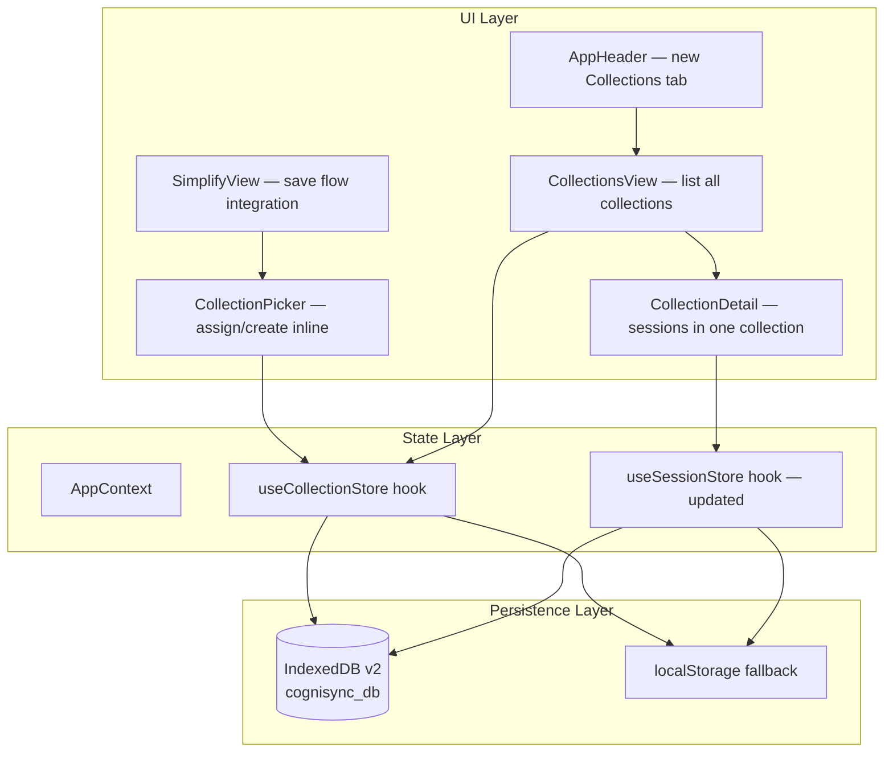

# Design Document — Session Collections

## Overview

Session Collections adds a lightweight organizational layer to CogniSync. Students can group sessions into named collections (e.g., "Physics 101", "Organic Chemistry") instead of scrolling a flat history list. The feature introduces:

- A `Collection` type persisted in a new IndexedDB object store
- A `collectionId` foreign key on the existing `Session` type
- A `useCollectionStore` hook mirroring the existing `useSessionStore` pattern
- Three new UI components: `CollectionsView`, `CollectionDetail`, `CollectionPicker`
- A new `/app/collections` route and "Collections" tab in the header

All collection data lives client-side in IndexedDB with a localStorage fallback, matching the existing persistence strategy. No backend changes are required.

## Architecture



The architecture follows the existing pattern: UI components consume hooks, hooks abstract IndexedDB/localStorage, and AppContext orchestrates shared state. The `useCollectionStore` hook is a peer to `useSessionStore` — both open the same `cognisync_db` database but operate on different object stores.

### IndexedDB Version Upgrade Strategy

The database version bumps from 1 → 2. The `onupgradeneeded` handler must be updated in a shared `openDB` function that both hooks use:

- **Version 1 → 2**: Create the `collections` object store with `keyPath: "id"` and a `name` index for efficient duplicate lookups.
- The existing `sessions` store remains untouched during the upgrade. The new `collectionId` field on sessions is optional (`string | null`), so existing session records are forward-compatible without migration.

### Design Decisions

1. **Shared `openDB`**: Both `useSessionStore` and `useCollectionStore` need to open the same database at version 2. A shared `openDB` utility in a new `cogni-sync/src/db/openDB.ts` module avoids duplicating upgrade logic.

2. **Virtual Uncategorized Collection**: Sessions with `collectionId === null` are grouped under a virtual "Uncategorized" collection in the UI. This is not a real record in IndexedDB — it's computed at render time by filtering sessions where `collectionId` is null.

3. **Collection name uniqueness**: Enforced at the hook level via case-insensitive comparison before writes. The IndexedDB `name` index enables efficient lookups but doesn't enforce uniqueness itself (IndexedDB unique indexes are case-sensitive).

4. **Timestamps as ISO strings**: Consistent with the existing `Session.savedAt` format. All `createdAt` and `updatedAt` fields use ISO 8601 strings.

## Components and Interfaces

### Shared Database Module

**File**: `cogni-sync/src/db/openDB.ts`

```typescript
const DB_NAME = 'cognisync_db';
const DB_VERSION = 2;

export function openDB(): Promise<IDBDatabase> {
  return new Promise((resolve, reject) => {
    const req = indexedDB.open(DB_NAME, DB_VERSION);
    req.onupgradeneeded = (event) => {
      const db = (event.target as IDBOpenDBRequest).result;
      const oldVersion = event.oldVersion;

      // v0 → v1: sessions store
      if (oldVersion < 1) {
        const sessions = db.createObjectStore('sessions', { keyPath: 'id' });
        sessions.createIndex('savedAt', 'savedAt', { unique: false });
        sessions.createIndex('fileName', 'fileName', { unique: false });
      }

      // v1 → v2: collections store
      if (oldVersion < 2) {
        const collections = db.createObjectStore('collections', { keyPath: 'id' });
        collections.createIndex('name', 'name', { unique: false });
      }
    };
    req.onsuccess = () => resolve(req.result);
    req.onerror = () => reject(req.error);
  });
}
```

### useCollectionStore Hook

**File**: `cogni-sync/src/hooks/useCollectionStore.ts`

Exports pure helper functions for testing and an API object:

```typescript
// Pure helpers (exported for testing)
export function validateCollectionName(name: string): string | null;
export function isNameDuplicate(name: string, existing: Collection[], excludeId?: string): boolean;
export function sortCollectionsByUpdatedAt(collections: Collection[]): Collection[];
export function getSessionsForCollection(sessions: Session[], collectionId: string | null): Session[];

// Hook API
export interface CollectionStoreAPI {
  createCollection: (name: string) => Promise<Collection>;
  renameCollection: (id: string, newName: string) => Promise<void>;
  deleteCollection: (id: string) => Promise<void>;
  getAllCollections: () => Promise<Collection[]>;
  getCollection: (id: string) => Promise<Collection | undefined>;
}

export function useCollectionStore(
  showToast?: (opts: { type: 'error'; title: string; message?: string }) => void,
): CollectionStoreAPI;
```

Validation rules:
- `validateCollectionName` returns an error string if the name is empty or whitespace-only, `null` if valid.
- `isNameDuplicate` performs case-insensitive comparison against existing collection names, optionally excluding a specific collection id (for rename).

### Updated useSessionStore

The existing `useSessionStore` hook is updated to:
1. Import `openDB` from the shared module instead of defining its own.
2. Add an `updateSession` method for updating `collectionId` on a session.
3. The `openDB` call now opens version 2, which creates the collections store if needed.

New method added to `SessionStoreAPI`:

```typescript
updateSession: (id: string, updates: Partial<Pick<Session, 'collectionId'>>) => Promise<void>;
```

### UI Components

#### CollectionsView

**File**: `cogni-sync/src/components/CollectionsView.tsx`

- Displays all user-created collections sorted by `updatedAt` descending
- Shows session count badge next to each collection name
- Shows "Uncategorized" section at the bottom when uncategorized sessions exist
- Includes a "New Collection" button that opens an inline name input
- Empty state when no collections exist
- Clicking a collection navigates to `CollectionDetail`

#### CollectionDetail

**File**: `cogni-sync/src/components/CollectionDetail.tsx`

- Displays sessions belonging to a specific collection, sorted by `savedAt` descending
- Header with collection name (editable inline for rename), session count, back button
- Each session row shows file name, date, and actions (restore, move, delete)
- "Move to…" action opens the `CollectionPicker`
- Empty state message when collection has no sessions
- Delete collection button with confirmation dialog

#### CollectionPicker

**File**: `cogni-sync/src/components/CollectionPicker.tsx`

- Dropdown/popover listing all collections + "Uncategorized" option
- "Create new collection" inline input at the top
- Validation errors shown inline (empty name, duplicate name)
- Used in two contexts:
  1. Save flow (SimplifyView) — optional collection selection when saving a session
  2. History/CollectionDetail — reassign a session to a different collection

### CollectionsPage

**File**: `cogni-sync/src/pages/CollectionsView.tsx`

- Page wrapper that loads collections and sessions, passes them to `CollectionsView` and `CollectionDetail`
- Uses `useCollectionStore` and `useSessionStore` hooks
- Manages local state for which collection is currently selected

### Router Changes

Add to the `/app` children in `router.tsx`:

```typescript
{ path: 'collections', element: <CollectionsPage /> },
{ path: 'collections/:collectionId', element: <CollectionsPage /> },
```

### AppHeader Changes

Add a new tab entry to the `TABS` array:

```typescript
{ id: 'collections', label: 'Collections', path: '/app/collections', end: false, Icon: FolderIcon },
```

A new `FolderIcon` SVG component is added alongside the existing icon components.

## Data Models

### Collection Type

**File**: `cogni-sync/src/types/index.ts` (addition)

```typescript
export interface Collection {
  id: string;          // crypto.randomUUID()
  name: string;        // user-defined, unique (case-insensitive)
  createdAt: string;   // ISO 8601 timestamp
  updatedAt: string;   // ISO 8601 timestamp
}
```

### Session Type Update

**File**: `cogni-sync/src/types/index.ts` (modification)

```typescript
export interface Session {
  // ... existing fields ...
  collectionId?: string | null;  // FK to Collection.id, null = uncategorized
}
```

The `collectionId` field is optional so existing sessions without it are treated as uncategorized (backward compatible).

### IndexedDB Schema

| Store | Version | keyPath | Indexes |
|-------|---------|---------|---------|
| `sessions` | 1 | `id` | `savedAt`, `fileName` |
| `collections` | 2 | `id` | `name` |

### localStorage Fallback Keys

| Key | Content |
|-----|---------|
| `cognisync_sessions` | `Session[]` (existing) |
| `cognisync_collections` | `Collection[]` (new) |


## Correctness Properties

*A property is a characteristic or behavior that should hold true across all valid executions of a system — essentially, a formal statement about what the system should do. Properties serve as the bridge between human-readable specifications and machine-verifiable correctness guarantees.*

### Property 1: Collection creation produces a valid record

*For any* valid (non-empty, non-whitespace) collection name, creating a collection SHALL produce a record with a non-empty `id`, `name` equal to the input, and `createdAt` equal to `updatedAt`, both being valid ISO 8601 timestamps.

**Validates: Requirements 1.1, 7.3**

### Property 2: Whitespace-only names are rejected

*For any* string composed entirely of whitespace characters (including empty string, spaces, tabs, newlines, and mixed whitespace), `validateCollectionName` SHALL return a non-null error string.

**Validates: Requirements 1.2, 2.2**

### Property 3: Case-insensitive duplicate name detection

*For any* collection name and any case variation of that name (upper, lower, mixed), `isNameDuplicate` SHALL return `true` when the variation is checked against a list containing the original name. When `excludeId` matches the collection's own id, `isNameDuplicate` SHALL return `false` for that collection's own name.

**Validates: Requirements 1.3, 2.3**

### Property 4: Rename preserves identity and updates timestamp

*For any* existing collection and any valid new name, renaming the collection SHALL preserve the original `id` and `createdAt`, update `name` to the new value, and set `updatedAt` to a value greater than or equal to the original `updatedAt`.

**Validates: Requirements 2.1**

### Property 5: Collection deletion removes only the target

*For any* list of collections and any collection in that list, deleting that collection SHALL result in a list that does not contain the deleted collection and contains all other collections unchanged.

**Validates: Requirements 3.1**

### Property 6: Deletion cascade nullifies session collectionIds

*For any* set of sessions with various `collectionId` values and a deleted collection id, after cascade, all sessions that had the deleted collection's id SHALL have `collectionId` set to `null`, and all other sessions SHALL remain unchanged.

**Validates: Requirements 3.2**

### Property 7: Session collectionId assignment

*For any* session and any target `collectionId` (including `null`), updating the session's `collectionId` SHALL produce a session where `collectionId` equals the target value and all other fields remain unchanged.

**Validates: Requirements 4.1, 4.3, 4.4, 5.1, 5.2**

### Property 8: Collections sorted by updatedAt descending

*For any* list of collections with distinct `updatedAt` values, `sortCollectionsByUpdatedAt` SHALL return them in descending `updatedAt` order — that is, for every adjacent pair, the earlier element has a `updatedAt` greater than or equal to the later element.

**Validates: Requirements 6.1**

### Property 9: getSessionsForCollection returns correct filtered and sorted results

*For any* list of sessions and any `collectionId`, `getSessionsForCollection` SHALL return only sessions whose `collectionId` matches the given value, sorted by `savedAt` in descending order, and the count SHALL equal the number of matching sessions in the input.

**Validates: Requirements 6.3, 6.4, 10.2**

## Error Handling

| Scenario | Behavior |
|----------|----------|
| IndexedDB unavailable | Fall back to localStorage with key `cognisync_collections`. Show no error to user — seamless degradation. |
| IndexedDB transaction failure | Catch error, show toast via `showToast({ type: 'error', ... })`, return safe default (empty array or undefined). Matches existing `useSessionStore` pattern. |
| Empty/whitespace collection name | Return validation error string from `validateCollectionName`. UI displays inline error. Operation is not attempted. |
| Duplicate collection name | Return `true` from `isNameDuplicate`. UI displays inline duplicate error. Operation is not attempted. |
| Delete collection with sessions | Cascade: set `collectionId = null` on all affected sessions within the same IndexedDB transaction. If transaction fails, neither the collection nor the sessions are modified (atomic). |
| Session references a deleted collection | Gracefully handled — `getSessionsForCollection` filters by `collectionId`, so orphaned references simply appear in "Uncategorized". No crash or error. |
| localStorage quota exceeded | Catch `QuotaExceededError`, show toast error. Existing data is preserved. |

## Testing Strategy

### Unit Tests (Example-Based)

- **UI rendering**: CollectionsView renders collections list, CollectionDetail renders sessions, CollectionPicker renders dropdown with inline creation
- **Confirmation dialog**: Delete collection shows confirmation before proceeding (Req 3.3)
- **Uncategorized positioning**: Uncategorized section renders after user-created collections (Req 6.2)
- **Empty state**: Collection with zero sessions shows empty-state message (Req 6.5)
- **Navigation**: AppHeader includes "Collections" tab, router renders CollectionsView at `/app/collections` (Req 8.1, 8.2)
- **Inline creation**: CollectionPicker allows creating a new collection and auto-selects it (Req 9.1, 9.2, 9.3)
- **Session deletion**: Deleting a session does not modify collection records (Req 10.1)

### Integration Tests

- **IndexedDB persistence**: Create, read, update, delete collections via IndexedDB (Req 1.4, 7.1)
- **localStorage fallback**: CRUD operations work when IndexedDB is unavailable (Req 7.2)
- **Database upgrade**: Opening the database creates the `collections` store with `name` index (Req 7.4)
- **Routing**: Navigating to `/app/collections` renders the correct view (Req 8.2)

### Property-Based Tests

All property tests use `fast-check` (already installed) with `vitest`. Each test runs a minimum of 100 iterations.

| Test | Property | Tag |
|------|----------|-----|
| Collection creation fields | Property 1 | Feature: session-collections, Property 1: Collection creation produces a valid record |
| Whitespace name rejection | Property 2 | Feature: session-collections, Property 2: Whitespace-only names are rejected |
| Duplicate name detection | Property 3 | Feature: session-collections, Property 3: Case-insensitive duplicate name detection |
| Rename preserves identity | Property 4 | Feature: session-collections, Property 4: Rename preserves identity and updates timestamp |
| Delete removes target only | Property 5 | Feature: session-collections, Property 5: Collection deletion removes only the target |
| Deletion cascade | Property 6 | Feature: session-collections, Property 6: Deletion cascade nullifies session collectionIds |
| CollectionId assignment | Property 7 | Feature: session-collections, Property 7: Session collectionId assignment |
| Sort by updatedAt | Property 8 | Feature: session-collections, Property 8: Collections sorted by updatedAt descending |
| Filter and sort sessions | Property 9 | Feature: session-collections, Property 9: getSessionsForCollection returns correct filtered and sorted results |

### Test File Structure

```
cogni-sync/src/__tests__/
  useCollectionStore.test.ts    — Property-based tests (P1–P9) + unit tests for pure helpers
  CollectionsView.test.tsx      — UI rendering and interaction tests
  CollectionPicker.test.tsx     — Inline creation and validation UI tests
```

### Arbitraries (fast-check generators)

The existing `sessionArb` from `useSessionStore.test.ts` will be extended with an optional `collectionId` field. A new `collectionArb` generator will produce random `Collection` objects:

```typescript
const collectionArb: fc.Arbitrary<Collection> = fc.record({
  id: fc.uuid(),
  name: fc.string({ minLength: 1, maxLength: 100 }).filter(n => n.trim().length > 0),
  createdAt: fc.date({ min: new Date('2020-01-01'), max: new Date('2030-01-01') }).map(d => d.toISOString()),
  updatedAt: fc.date({ min: new Date('2020-01-01'), max: new Date('2030-01-01') }).map(d => d.toISOString()),
});
```
